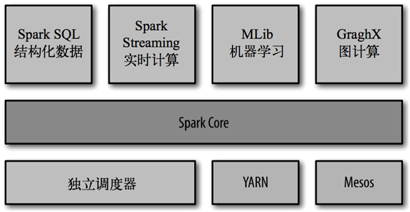
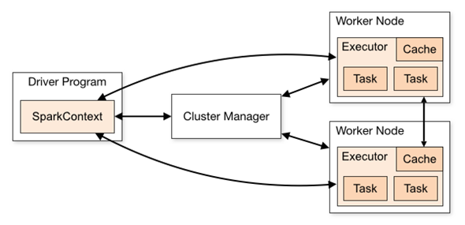
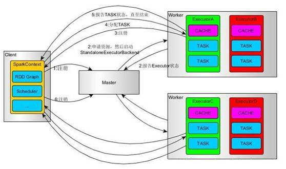
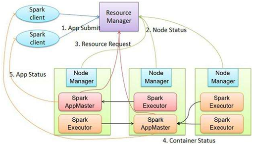

# SPARK

## Spark概述
### 什么是Spark
Spark是一种快速、通用、可扩展的大数据分析引擎，2009年诞生于加州大学伯克利分校AMPLab，2010年开源，2013年6月成为Apache孵化项目，2014年2月成为Apache顶级项目。项目是用Scala进行编写。  

目前，Spark生态系统已经发展成为一个包含多个子项目的集合，其中包含SparkSQL、Spark Streaming、GraphX、MLib、SparkR等子项目，Spark是基于内存计算的大数据并行计算框架。除了扩展了广泛使用的 MapReduce 计算模型，而且高效地支持更多计算模式，包括交互式查询和流处理。Spark 适用于各种各样原先需要多种不同的分布式平台的场景，包括批处理、迭代算法、交互式查询、流处理。通过在一个统一的框架下支持这些不同的计算，Spark 使我们可以简单而低耗地把各种处理流程整合在一起。而这样的组合，在实际的数据分析 过程中是很有意义的。不仅如此，Spark 的这种特性还大大减轻了原先需要对各种平台分 别管理的负担。 
大一统的软件栈，各个组件关系密切并且可以相互调用，这种设计有几个好处：1、软件栈中所有的程序库和高级组件 都可以从下层的改进中获益。2、运行整个软件栈的代价变小了。不需要运 行 5 到 10 套独立的软件系统了，一个机构只需要运行一套软件系统即可。系统的部署、维护、测试、支持等大大缩减。3、能够构建出无缝整合不同处理模型的应用。  

Spark的内置项目如下：

* Spark Core：实现了 Spark 的基本功能，包含任务调度、内存管理、错误恢复、与存储系统 交互等模块。Spark Core 中还包含了对弹性分布式数据集(resilient distributed dataset，简称RDD)的 API 定义。 
* Spark SQL：是 Spark 用来操作结构化数据的程序包。通过 Spark SQL，我们可以使用 SQL 或者 Apache Hive 版本的 SQL 方言(HQL)来查询数据。Spark SQL 支持多种数据源，比 如 Hive 表、Parquet 以及 JSON 等。 
* Spark Streaming：是 Spark 提供的对实时数据进行流式计算的组件。提供了用来操作数据流的 API，并且与 Spark Core 中的 RDD API 高度对应。 
* Spark MLlib：提供常见的机器学习(ML)功能的程序库。包括分类、回归、聚类、协同过滤等，还提供了模型评估、数据 导入等额外的支持功能。 
集群管理器：Spark 设计为可以高效地在一个计算节点到数千个计算节点之间伸缩计 算。为了实现这样的要求，同时获得最大灵活性，Spark 支持在各种集群管理器(cluster manager)上运行，包括 Hadoop YARN、Apache Mesos，以及 Spark 自带的一个简易调度 器，叫作独立调度器。   

Spark得到了众多大数据公司的支持，这些公司包括Hortonworks、IBM、Intel、Cloudera、MapR、Pivotal、百度、阿里、腾讯、京东、携程、优酷土豆。当前百度的Spark已应用于凤巢、大搜索、直达号、百度大数据等业务；阿里利用GraphX构建了大规模的图计算和图挖掘系统，实现了很多生产系统的推荐算法；腾讯Spark集群达到8000台的规模，是当前已知的世界上最大的Spark集群。

### Spark特点

1）快：与Hadoop的MapReduce相比，Spark基于内存的运算要快100倍以上，基于硬盘的运算也要快10倍以上。Spark实现了高效的DAG执行引擎，可以通过基于内存来高效处理数据流。计算的中间结果是存在于内存中的。  

2）易用：Spark支持Java、Python和Scala的API，还支持超过80种高级算法，使用户可以快速构建不同的应用。而且Spark支持交互式的Python和Scala的shell，可以非常方便地在这些shell中使用Spark集群来验证解决问题的方法。  

3）通用：Spark提供了统一的解决方案。Spark可以用于批处理、交互式查询（Spark SQL）、实时流处理（Spark Streaming）、机器学习（Spark MLlib）和图计算（GraphX）。这些不同类型的处理都可以在同一个应用中无缝使用。Spark统一的解决方案非常具有吸引力，毕竟任何公司都想用统一的平台去处理遇到的问题，减少开发和维护的人力成本和部署平台的物力成本。  

4）兼容性：Spark可以非常方便地与其他的开源产品进行融合。比如，Spark可以使用Hadoop的YARN和Apache Mesos作为它的资源管理和调度器，器，并且可以处理所有Hadoop支持的数据，包括HDFS、HBase和Cassandra等。这对于已经部署Hadoop集群的用户特别重要，因为不需要做任何数据迁移就可以使用Spark的强大处理能力。Spark也可以不依赖于第三方的资源管理和调度器，它实现了Standalone作为其内置的资源管理和调度框架，这样进一步降低了Spark的使用门槛，使得所有人都可以非常容易地部署和使用Spark。此外，Spark还提供了在EC2上部署Standalone的Spark集群的工具。  

### Spark的用户和用途
我们大致把Spark的用例分为两类：数据科学应用和数据处理应用。也就对应的有两种人群：数据科学家和工程师。
数据科学任务：主要是数据分析领域，数据科学家要负责分析数据并建模，具备 SQL、统计、预测建模(机器学习)等方面的经验，以及一定的使用 Python、 Matlab 或 R 语言进行编程的能力。  
数据处理应用：工程师定义为使用 Spark 开发 生产环境中的数据处理应用的软件开发者，通过对接Spark的API实现对处理的处理和转换等任务。  

## Spark角色介绍及运行模式
### 集群角色

从物理部署层面上来看，Spark主要分为两种类型的节点，Master节点和Worker节点：Master节点主要运行集群管理器的中心化部分，所承载的作用是分配Application到Worker节点，维护Worker节点，Driver，Application的状态。Worker节点负责具体的业务运行。  

从Spark程序运行的层面来看，Spark主要分为驱动器节点和执行器节点。

### 运行模式
1）Local模式: Local模式就是运行在一台计算机上的模式，通常就是用于在本机上练手和测试。它可以通过以下集中方式设置master。
local: 所有计算都运行在一个线程当中，没有任何并行计算，通常我们在本机执行一些测试代码，或者练手，就用这种模式;
local[K]: 指定使用几个线程来运行计算，比如local[4]就是运行4个worker线程。通常我们的cpu有几个core，就指定几个线程，最大化利用cpu的计算能力;
local[*]: 这种模式直接帮你按照cpu最多cores来设置线程数了。  

2）Standalone模式: 构建一个由Master+Slave构成的Spark集群，Spark运行在集群中。  

3）Yarn模式: Spark客户端直接连接Yarn；不需要额外构建Spark集群。有yarn-client和yarn-cluster两种模式，主要区别在于：Driver程序的运行节点。  
yarn-client：Driver程序运行在客户端，适用于交互、调试，希望立即看到app的输出  
yarn-cluster：Driver程序运行在由RM（ResourceManager）启动的AP（APPMaster）适用于生产环境  

4）Mesos模式:Spark客户端直接连接Mesos；不需要额外构建Spark集群。国内应用比较少，更多的是运用yarn调度。  

